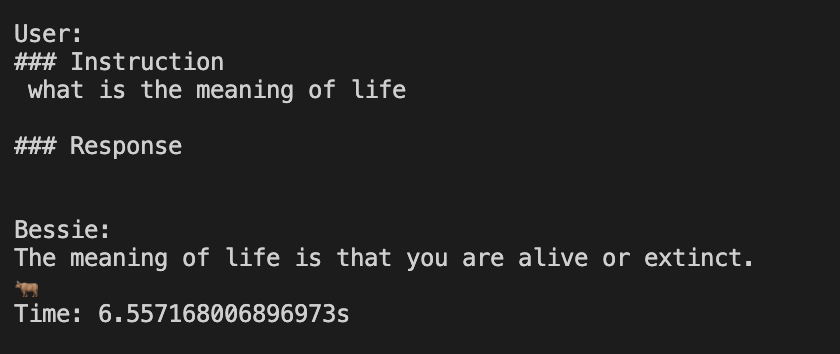

# BitNet-1.58-Instruct

📕 Resources.
🔗 Blog Post: https://lnkd.in/d5YCRW4y
🐱 GitHub Repo: https://lnkd.in/dKgjwFXk
🐝 wandb dashboard: https://lnkd.in/de5myJ6G
👨‍💻 Lightning Studio link: https://lnkd.in/d8Ji9FQh

### What's changed in this repo. 
* Added wandb tracking
* Able to run over CPU and multiGPU for finetuning LLM
* Fientuned over the mistralai data
* Evaluated by using LLM as a judge

Implementation of BitNet-1.58 instruct tuning. All data and models are versioned and stored on [Oxen.ai](https://Oxen.ai/ox/BitNet) at [ox/BitNet](https://Oxen.ai/ox/BitNet). This work builds off the pre-trained models released in the [1bitLLM/bitnet_b1_58-large](https://huggingface.co/1bitLLM/bitnet_b1_58-large) project on Hugging Face.

Code Name: Bessie the BitNet 🐂

## Comparison of Model Outputs Before and After Finetuning

## Old Outputs (Before Finetuning)
**Model Correctness**
| is_correct | count |
|------------|-------|
| True       | 73    |
| False      | 27    |

**Model Metric: Accuracy**
| is_correct | proportion |
|------------|------------|
| True       | 0.73       |
| False      | 0.27       |

## New Outputs (After Finetuning)
**Model Correctness**
| is_correct | count |
|------------|-------|
| True       | 75    |
| False      | 25    |

**Model Metric: Accuracy**
| is_correct | proportion |
|------------|------------|
| True       | 0.75       |
| False      | 0.25       |

**Improvement**: After finetuning, there is a 2% improvement in model accuracy.

## output examples 





## Motivation

This is work done was originally done for the [arXiv dive community](https://oxen.ai/community) and more info on BitNets can be found on our [blog post](https://www.oxen.ai/blog/arxiv-dives-bitnet-1-58).

We also have some internal use cases at [Oxen.ai](https://oxen.ai) for a fast and local LLM. BitNet 1.58 seem like an interesting direction. We will open source our models, data, and code as we go.

## Inference

There is a simple script to prompt given a system message. You can give it a base llm or fine tuned llm.

### Run Base Model

```bash
python scripts/prompt.py -m 1bitLLM/bitnet_b1_58-large
```

### Run Fine-Tuned Model

```bash
oxen download ox/BitNet models/bitnet_b1_58-large-instruct-100k
python scripts/prompt.py -m models/bitnet_b1_58-large-instruct-100k
```

## Training

The training was done on an A10 with 24GB of VRAM. We cut off the max seq len to 768 because otherwise it runs out of VRAM on some batches. Would be nice to kick off a train on a larger GPU and larger context length.

```bash
python tools/train.py -d -m 1bitLLM/bitnet_b1_58-large -d train.jsonl -o results/bitnet_b1_58-large-instruct
```

## Pre-Training

The models are trained with [RedPajama dataset](https://github.com/togethercomputer/RedPajama-Data) for 100B tokens. The hypers, as well as two-stage LR and weight decay, are implemented as suggested in their following paper. 

NOTE: This repo does not perform the pre-training, just uses these models as a jumping off point for instruct tuning.

## Instruct Tuning Data

The instruct tuning was done on a mix of data:

1) SQuADv2 with context and questions
2) mosaicml/instruct-v3

You can see the mix of data here:

https://www.oxen.ai/ox/BitNet/file/main/train.jsonl

```bash
oxen download ox/BitNet train.jsonl
oxen download ox/BitNet dev.jsonl
```

### Data Format

The dataset should be jsonl with `prompt` and `response` fields for the SFT step.

```
head -n 1 train.jsonl | jq
```

```json
{
  "prompt": "What is Oxen.ai?",
  "response": "Oxen.ai is a Open-source tools to track, iterate, collaborate on, and discover multi-modal data in any format.",
  "source": "manual"
}
```

### System Prompt

The system prompt is currently hard coded into `bitnet/prompts/assistant_prompt.py`. 

```
You are Bessie, created by Oxen.ai. You are happy to help with writing, analysis, question answering, math, coding, and all sorts of other tasks. You give concise responses to simple questions or statements, but provide thorough responses to more complex and open-ended questions. Answer the user's query as best as you can, and say "I don't know" if you don't know the answer.
```

## TODO: Evaluation

For evaluation purposes, we are also using SQuAD dataset. The idea is the model should be able to answer generic questions as well as extract answers from questions and context if provided.

If the answer is not in the context, we want to be able to say "Not in context.".

```bash
python tools/eval.py -m results/bitnet_b1_58-large-instruct/final_checkpoint/ -d dev.jsonl -o eval.jsonl -n 100
```

The eval script outputs a dataframe like this:

```
TODO:
```
